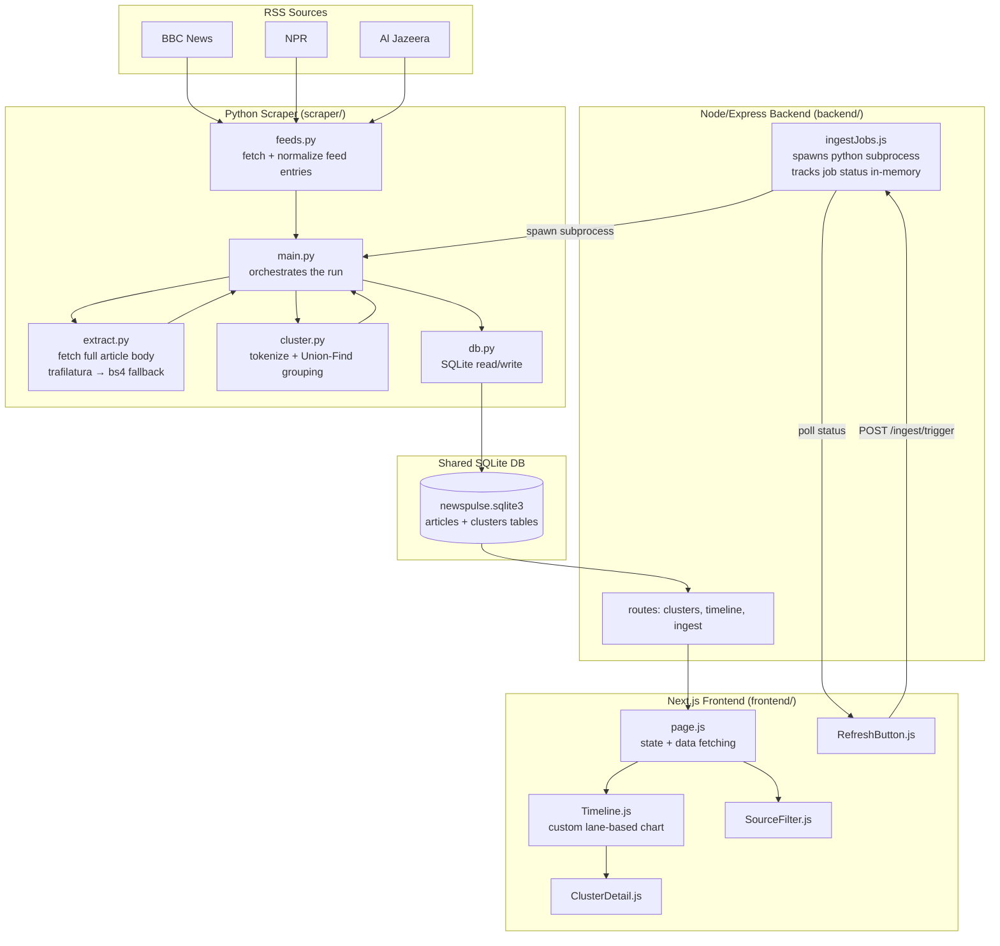

# News Pulse — Topic-Clustered News Timeline

A small system that pulls live articles from RSS feeds, groups related
articles into topic clusters, and displays them on a visual timeline.

Built for the Xponentium Technology Intern take-home assessment.

## Architecture

```
/scraper   Python — RSS ingestion, full-article extraction, topic clustering
/backend   Node.js/Express — REST API serving clusters/timeline, writes to
           the same SQLite DB, triggers the scraper as a subprocess
/frontend  Next.js/React — timeline visualization + cluster explorer
```

All three share a single SQLite database file at `/data/newspulse.sqlite3`.
The Python pipeline is the only writer; the Node API reads from it (and
also invokes the pipeline on demand via `POST /ingest/trigger`).

SQLite was chosen (over Postgres/MongoDB) because it needs zero external
infra for local dev and review, and is one of the officially-allowed
options. See **Deployment** below for the tradeoff this creates on
ephemeral hosting.

### Data Flow Diagram



### Component Details

**Scraper (`scraper/`)**
- `feeds.py` — fetches each RSS feed and normalizes inconsistent field names
  (`<description>` vs `<content:encoded>`) and date formats into one schema:
  `{url, title, summary, source, published_at}`. Wraps each feed fetch in
  try/except so one broken feed never kills the run.
- `extract.py` — fetches the full article page and pulls out the main body
  via `trafilatura`, falling back to a plain BeautifulSoup `<p>`-tag scrape,
  and finally to the RSS summary if both fail. Never raises.
- `cluster.py` — tokenizes `title + summary`, drops stop words, and links
  articles sharing ≥3 meaningful words or Jaccard similarity ≥0.25. A
  Union-Find structure merges transitively related articles into one
  cluster, then labels each cluster with its most frequent shared words.
- `db.py` — SQLite schema (`articles`, `clusters` tables); `url UNIQUE` +
  `INSERT OR IGNORE` makes re-running the scraper idempotent.
- `main.py` — orchestrates a run: skip already-seen URLs, extract full text
  only for new articles, recluster the recent window from scratch, and
  print a machine-readable `SCRAPE_RESULT: {json}` line for the Node
  backend to capture from the subprocess's stdout.

**Backend (`backend/`)**
- `routes/clusters.js` — `GET /clusters` (label, article count, time range)
  and `GET /clusters/:id` (full article list, sorted chronologically, with
  400/404 handling).
- `routes/timeline.js` — `GET /timeline`, shaped for a charting library:
  `start_time`/`end_time`, `article_count`, and a normalized `intensity`
  (`article_count / maxCount`) so the frontend can size markers without
  recomputing anything.
- `routes/ingest.js` + `ingestJobs.js` — `POST /ingest/trigger` spawns the
  Python scraper as a subprocess and returns a `jobId` immediately;
  `GET /ingest/status/:jobId` polls an in-memory job map that's updated
  when the subprocess closes.

**Frontend (`frontend/`)**
- `app/page.js` — top-level state: timeline data, active source filters,
  selected cluster.
- `components/Timeline.js` (+ `lib/timeGeometry.js`) — a custom-built
  timeline (no charting library): a linear time scale maps timestamps to
  horizontal position, overlapping clusters are packed into non-overlapping
  lanes, and block opacity scales with `intensity` (bigger cluster = bolder
  marker).
- `components/ClusterDetail.js` — fetches `/clusters/:id` and renders the
  article list for the selected cluster.
- `components/SourceFilter.js` — toggle chips per source, filters the
  timeline client-side.
- `components/RefreshButton.js` — calls `POST /ingest/trigger`, polls
  `GET /ingest/status/:jobId` until done, then reloads the timeline.

## News Sources Used

- BBC News — `http://feeds.bbci.co.uk/news/rss.xml`
- NPR — `https://feeds.npr.org/1001/rss.xml`
- Al Jazeera — `https://www.aljazeera.com/xml/rss/all.xml`

Configurable via the `FEEDS` env var (see `scraper/config.py`).

## Part 1 — Topic Grouping Approach

**Option A: keyword/word-overlap grouping.** No ML dependency required to
run reliably; a good fit for clustering same-day news where outlets share
proper nouns and topic words.

1. Tokenize each article's `title + summary` — lowercase, strip
   punctuation, drop stop words and words shorter than 3 characters
   (`scraper/stopwords.py`, `scraper/cluster.py`).
2. Compare every pair of articles' token sets. Two articles are linked if
   they share **≥ 3 meaningful words** (`CLUSTER_MIN_SHARED_WORDS`) OR their
   **Jaccard similarity ≥ 0.25** (`CLUSTER_MIN_JACCARD`) — the second
   threshold catches short headlines where 3 raw shared words is too strict
   relative to their total vocabulary.
3. Union-Find merges transitively linked articles into clusters (A~B, B~C
   ⇒ one cluster), which lets a story reported slightly differently by 3
   outlets still land together even if no single pair shares every word.
4. Each cluster is labeled with its most frequent shared words (or the
   original headline if it's a singleton cluster).

**Threshold tuning:** picked by manual inspection against real BBC/NPR/Al
Jazeera pulls — 3 shared words / 0.25 Jaccard grouped genuinely related
wire-style headlines (e.g. multiple outlets covering the UN General
Assembly) without merging unrelated stories that happen to share one or
two generic words like "trump" or "says" (which are also stripped as
stop-words/filler — see `stopwords.py`).

**Known limitation:** pure keyword overlap doesn't understand synonyms or
paraphrasing — two articles about the same event using entirely different
vocabulary (e.g. "PM resigns" vs. "Downing Street leadership change")
won't be linked. A TF-IDF/embedding-based approach (Option B) would catch
more of these at the cost of needing scikit-learn and more tuning.

Clustering is recomputed from scratch on every ingestion run (bounded to
the last `CLUSTER_LOOKBACK_DAYS`, default 14) rather than incrementally
updated — simpler to reason about and fast enough at this data volume, but
means cluster IDs are not stable across runs (a known tradeoff, noted in
code comments in `scraper/main.py`).

## Setup — Local Development

### 1. Scraper
```bash
cd scraper
python3 -m venv .venv && source .venv/bin/activate
pip install -r requirements.txt
python main.py          # populates ../data/newspulse.sqlite3
```

### 2. Backend
```bash
cd backend
npm install
cp .env.example .env    # adjust PYTHON_BIN to point at scraper/.venv/bin/python
npm run dev             # http://localhost:4000
```

### 3. Frontend
```bash
cd frontend
npm install
cp .env.local.example .env.local
npm run dev             # http://localhost:3000
```

Click **Refresh data** in the UI (or `POST /ingest/trigger`) to re-run the
scraper from the running backend and repopulate the timeline.

## API Endpoints

| Endpoint | Purpose |
| --- | --- |
| `GET /clusters` | List clusters — label, article count, time range |
| `GET /clusters/:id` | Full cluster detail, articles sorted chronologically |
| `GET /timeline` | Clusters shaped for charting: start/end, count, intensity |
| `POST /ingest/trigger` | Runs the scraper as a subprocess, returns `{ jobId }` |
| `GET /ingest/status/:jobId` | Poll job status: `running`/`completed`/`failed` |

## Assumptions Made

- No cross-source story merging (stretch goal) — same story from two
  outlets may appear as two separate single-article clusters if their
  headlines don't share enough vocabulary.
- Ingest jobs are tracked in-memory in the backend process; this is fine
  for a single instance but wouldn't survive a backend restart or scale to
  multiple replicas without a shared job store.
- `/ingest/trigger` is unauthenticated for simplicity — a production
  version would rate-limit or auth-gate this to avoid abuse.

## Deployment

| Component | What runs where | Why |
| --- | --- | --- |
| Frontend | Vercel | Native Next.js support, generous free tier |
| Backend | Render/Railway | Simple Node deploys, can run a Python subprocess alongside |
| Python pipeline | Invoked on-demand by the backend (`POST /ingest/trigger`); can also be run as a scheduled job/cron on the same host | Keeps ingestion and the DB write path in one place |
| Database | SQLite file on the backend host's persistent disk (or swap to Postgres via `DATABASE_URL` if the host's disk isn't persistent) | Zero extra infra for review; noted limitation: most free-tier PaaS disks are ephemeral on redeploy, so a hosted Postgres (Neon/Supabase) is a straightforward upgrade path if long-term persistence is needed |

Environment variables (`DB_PATH`, `PYTHON_BIN`, `CORS_ORIGIN`,
`NEXT_PUBLIC_API_URL`, etc.) are set on the hosting platform, never
committed — see `backend/.env.example` and `frontend/.env.local.example`.

### Deploy steps

**Backend (Render):**
1. Push this repo to GitHub.
2. On Render, "New +" → "Blueprint" → point at this repo. It picks up
   `render.yaml`, which builds `backend/Dockerfile` (needed because the
   backend spawns the Python scraper as a subprocess, so the image bundles
   both Node and Python runtimes) and attaches a persistent disk at
   `/app/data` for the SQLite file.
3. Set `CORS_ORIGIN` to your deployed frontend URL once you have it.

**Frontend (Vercel):**
1. Import the repo on Vercel, set the project root directory to `frontend`.
2. Add env var `NEXT_PUBLIC_API_URL` = your Render backend URL.
3. Deploy (`vercel.json` just pins the framework preset).

**Python pipeline:** triggered on-demand via the backend's
`POST /ingest/trigger` (no separate deploy needed — it runs inside the
backend's container). `.github/workflows/scrape.yml` is included as an
optional alternative if you'd rather run it on a schedule instead.
